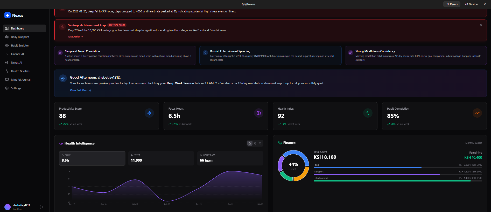
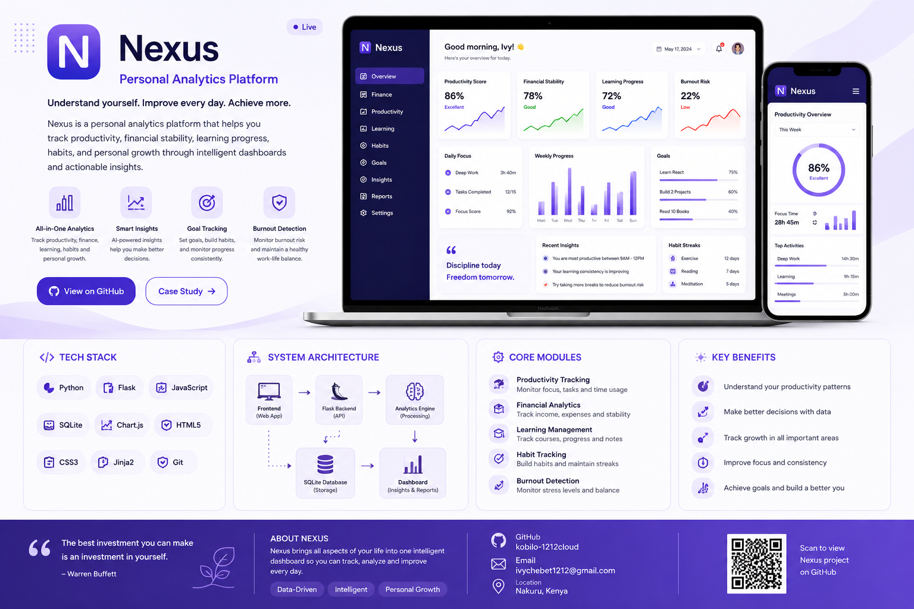
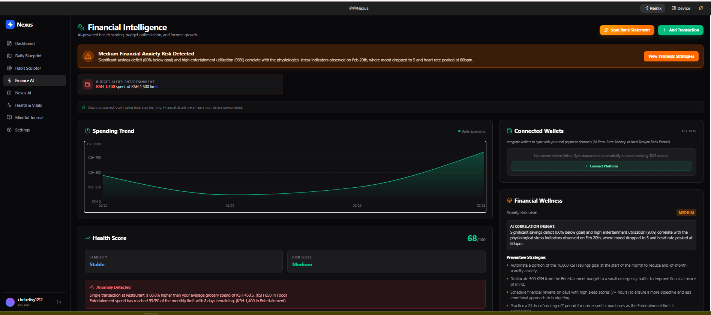

<div align="center">

# 🧠 NEXUS

### Intelligent Personal Risk & Growth System

**A Personal Intelligence Engine for Everyday Life**

Transforming personal data into actionable insights through intelligent analytics, predictive risk assessment, and personalized recommendations.


</div>

---

# 🚀 Hero Preview

<p align="center">
  
</p>

---

# 📖 About NEXUS

NEXUS is an intelligent multi-domain life analytics platform that evaluates a person's overall life stability by analyzing four interconnected areas of life:

- 💰 Financial Stability
- 🧠 Mental & Burnout Risk
- ⚡ Productivity & Discipline
- 📚 Personal Growth & Learning

Unlike traditional budgeting or productivity apps, NEXUS combines these domains into a single intelligent platform that measures current performance, predicts future risks, and provides actionable recommendations to improve long-term wellbeing.

---

# ✨ Core Features

## 💰 Financial Intelligence

- Income & expense analysis
- Savings health monitoring
- Debt ratio analysis
- Spending trend visualization
- Financial Risk Score
- Days Until Broke estimation
- AI financial recommendations

---

## 🧠 Mental & Burnout Intelligence

- Burnout Risk Score
- Sleep quality analysis
- Stress monitoring
- Exercise tracking
- Wellness recommendations
- Recovery planning

---

## ⚡ Productivity Intelligence

- Focus tracking
- Goal completion analysis
- Habit monitoring
- Productivity Score
- Weekly performance insights

---

## 📚 Personal Growth Intelligence

- Learning progress tracking
- Skill development monitoring
- Career direction analysis
- Growth Momentum Score
- Personalized learning recommendations

---

## 🤖 Intelligent Recommendation Engine

NEXUS analyzes all four domains together to generate personalized recommendations.

Examples include:

- Reduce unnecessary spending.
- Increase emergency savings.
- Improve sleep consistency.
- Schedule recovery time.
- Increase focused work sessions.
- Continue positive learning habits.

---

# 📸 Screenshots

## 🚀 Landing Page


*A modern landing page introducing NEXUS as a personal intelligence platform.*

---

## 📊 Main Dashboard



*Interactive analytics dashboard displaying productivity, health, finance, and AI-generated insights.*

---

## 💰 Financial Intelligence Module



*Advanced financial analytics with spending trends, risk detection, budgeting insights, and AI-powered recommendations.*

---

# 🛠 Technology Stack

| Frontend | Backend | Database | Analytics |
|----------|----------|-----------|-----------|
| HTML5 | PHP 8 | MySQL | Chart.js |
| Tailwind CSS | Object-Oriented PHP | PDO | Interactive Charts |
| JavaScript | Sessions | SQL | Data Visualization |

---

# 🏗 System Architecture

```text
                     User
                      │
                      ▼
              Authentication
                      │
                      ▼
             Data Collection Layer
                      │
                      ▼
        ┌────────────────────────────┐
        │    Risk Analysis Engines    │
        └────────────────────────────┘
          │      │      │       │
          ▼      ▼      ▼       ▼
   Financial Mental Productivity Growth
          │      │      │       │
          └──────┴──────┴───────┘
                     │
                     ▼
         Life Stability Index Engine
                     │
                     ▼
       Recommendation & Trend Engine
                     │
                     ▼
             Analytics Dashboard
```

---

# 📂 Project Structure

```text
NEXUS/
│
├── api/
├── assets/
│   ├── css/
│   ├── js/
│   ├── images/
│
├── config/
├── controllers/
├── database/
│   └── schema.sql
├── docs/
│   └── screenshots/
│       ├── landing-page.png
│       ├── dashboard.png
│       └── finance-module.png
├── engines/
├── models/
├── views/
├── README.md
├── LICENSE
└── .gitignore
```

---

# 📈 Development Roadmap

## ✅ Version 1.0

- User Authentication
- Dashboard UI
- Financial Intelligence
- Productivity Module
- Learning Module

## 🚧 Version 2.0

- Mental Health Intelligence
- AI Recommendation Engine
- Trend Prediction
- Cross-Domain Correlation

## 🔮 Version 3.0

- Mobile Application
- REST API
- Email Notifications
- PDF Reports
- Cloud Deployment
- AI Chat Assistant

---

# ⚙ Installation

Clone the repository:

```bash
git clone https://github.com/YOUR_GITHUB_USERNAME/NEXUS.git
```

Navigate into the project:

```bash
cd NEXUS
```

Start Apache and MySQL using XAMPP.

Import:

```text
database/schema.sql
```

Configure your database credentials inside:

```text
config/database.php
```

Open your browser:

```text
http://localhost/NEXUS
```

---

# 🎥 Demo

## 🌐 Live Demo

Coming Soon

## 📹 Demo Video

Coming Soon

---

# 🤝 Contributing

Contributions are welcome.

1. Fork the repository.
2. Create a new feature branch.
3. Commit your changes.
4. Push to GitHub.
5. Open a Pull Request.

---

# 👩‍💻 Author

**Ivy Chebet**

Diploma in Information Technology

**Project:** NEXUS – Intelligent Personal Risk & Growth System

GitHub: https://github.com/YOUR_GITHUB_USERNAME

---

# 📄 License

This project is licensed under the MIT License.

---

<div align="center">

## ⭐ Support the Project

If you found NEXUS interesting, consider giving this repository a **Star ⭐**.

It helps others discover the project and motivates continued development.

### "Understand yourself. Improve every day. Achieve more."

Made with ❤️ by **Ivy Chebet**

</div>
